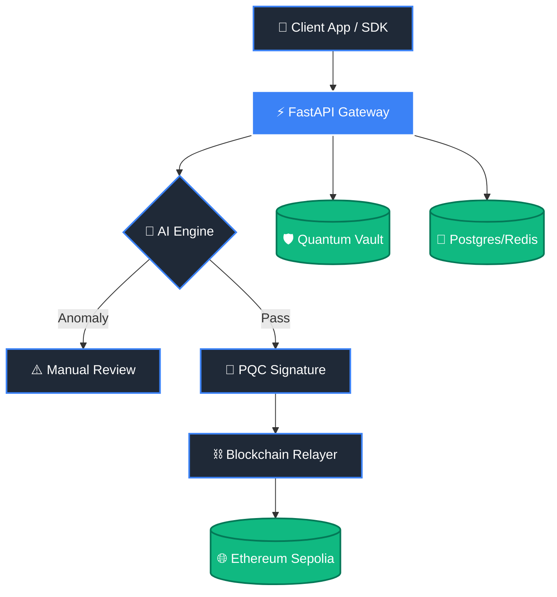

# 🌌 Q-AI Chain Protocol
### *Quantum-Secure AI-Powered Trust Protocol*

**Q-AI Chain** is a state-of-the-art modular protocol for identity verification, transaction security, and fraud prevention in a post-quantum world. 

[**Explore Setup Guide**](SETUP_GUIDE.md) | [**View SDK Docs**](sdk/README.md) | [**Architecture**](docs/architecture.md)

---

## 💎 Core Pillars

<table align="center">
  <tr>
    <td align="center"><h3>🧠 AI Engine</h3></td>
    <td align="center"><h3>🛡 Quantum Security</h3></td>
    <td align="center"><h3>⛓ Blockchain Trust</h3></td>
  </tr>
  <tr>
    <td><strong>Isolation Forest</strong> anomaly detection detects fraud before it happens.</td>
    <td>Integrated with <strong>Dilithium2</strong> and <strong>Kyber</strong> for PQ resistance.</td>
    <td>Immutable anchoring of trust scores and identities on-chain.</td>
  </tr>
</table>

---

## 🏗 System Architecture

---

## 🚀 Key Features

* ✨ **PQC-DID Registry**: Decentralized identities secured by Post-Quantum Cryptography.
* ⚡ **Real-Time Risk Scoring**: Dynamic risk assessment for every transaction.
* 🔄 **Relayer Pathing**: Advanced on-chain anchoring with nonce-management and idempotency.
* 🛠 **Developer First**: Fully typed FastAPI backend and a clean, lightweight JS SDK.

---

## 📂 Protocol Components

| Module | Description | Path |
| :--- | :--- | :--- |
| 📜 **Contracts** | Solidity registries for Identity, Transactions, and Risk | `contracts/` |
| ⚙️ **Backend** | Protocol logic featuring Dilithium/Kyber integration | `backend/` |
| 🧠 **AI Engine** | Local AI artifacts for deterministic fraud detection | `ai-engine/` |
| 🎨 **Frontend** | Premium Tailwind-powered dashboard for network monitoring | `frontend/` |
| 📦 **SDK** | Ethers.js v6 abstraction for third-party service integration | `sdk/` |
| 🐳 **Infra** | Dockerized environment for instant local deployment | `infra/` |

---

> [!TIP]
> **Getting Started?**
> The safest way to deploy is through our specialized infrastructure! Check the `infra/` folder for one-command deployment.

---

  
  
Developed for a <strong>secure, decentralized, and intelligent future</strong>.

